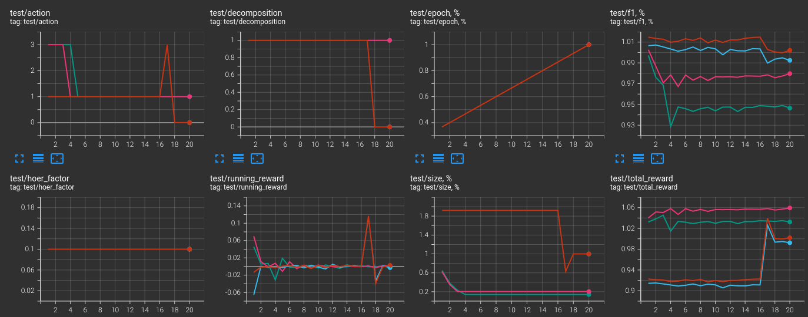
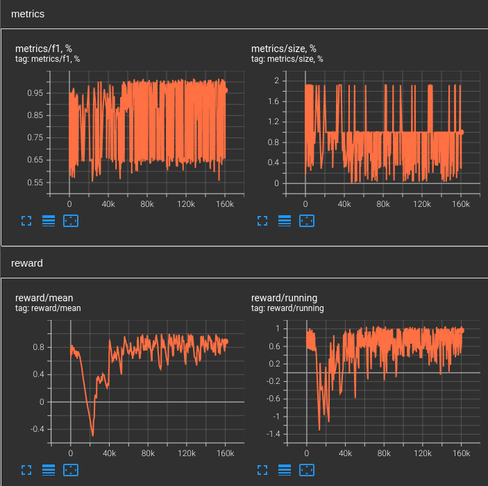
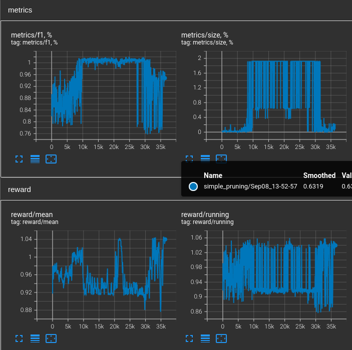

# 25.09.2023

Two baselines were got.

## simple_dec

```
actions=[<Actions.train_compose: 0>, <Actions.train_decompose: 1>, <Actions.prune_9: 3>]
state=['decomposition', 'epoch', 'f1', 'size']
f1_baseline=0.776
decomposing_mode=spatial
epochs=30
mean_reward_bound=1.01
gamma=1
lr=0.0001
batch_size=16
buffer_size=100000
buffer_start_size=500
sync_target_epochs=50
epsilon_start=1.0
epsilon_final=0.01
epsilon_step=0.0001
```


## simple_pruning

```
actions=[<Actions.train_decompose: 1>, <Actions.prune_9: 3>]
state=['f1', 'size']
f1_baseline=0.776
decomposing_mode=spatial
epochs=30
start_epoch=10
skip_impossible_steps=False
running_reward=False
mean_reward_bound=1.05
gamma=1
lr=0.0001
batch_size=16
buffer_size=1000000
buffer_start_size=1000
sync_target_epochs=600
epsilon_start=1.0
epsilon_final=0.01
epsilon_step=0.0001
```



## research plan

- use 2-step states
- explore the reward function
- complication of the environment

Next step: check the impact of the observed epoch for simple_pruning

